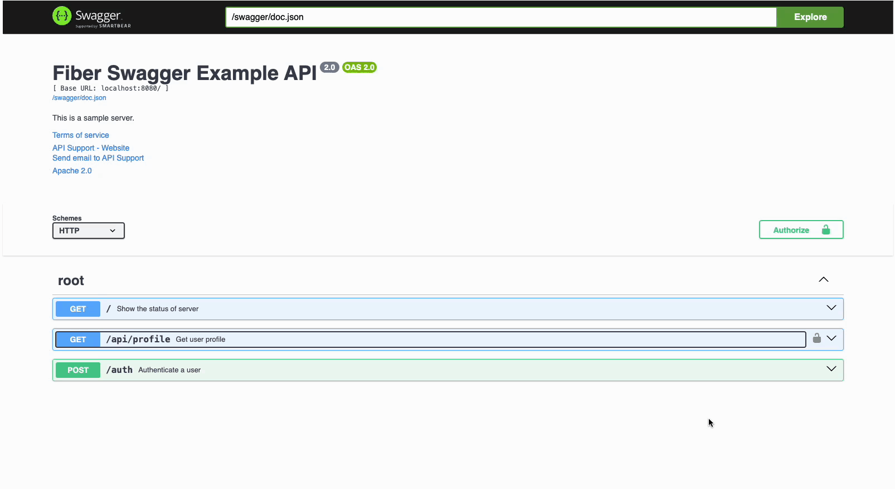

# Go Swagger Auth Form

This is a simple go package to generate a form for authentication in swagger.

## Usage

Example of using this package in a Go Fiber app. You can find the full code over https://github.com/schmentle/swagger-auth-example.

```go  
import (
	"github.com/gofiber/fiber/v2"
	"github.com/gofiber/fiber/v2/middleware/adaptor"
	"github.com/golang-jwt/jwt/v4"
	"net/http"
	"os"
	"swagger-auth-example/middleware"
	"time"

	"github.com/gofiber/fiber/v2/middleware/cors"
	"github.com/gofiber/fiber/v2/middleware/recover"
	"github.com/schmentle/go-swagger-auth-form/swagger" // Import the package
	"log"
	_ "swagger-auth-example/docs"
)

// @title Swagger Auth Example API
...
func main() {
    ...
	
    swaggerDocURL := os.Getenv("SWAGGER_DOC_URL")
    if swaggerDocURL == "" {
        swaggerDocURL = "/swagger/doc.json"
    }
    
    authApiUrl := os.Getenv("AUTH_URL")
    if authApiUrl == "" {
        authApiUrl = "/auth"
    }
    ...

    app.Get("/swagger/doc.json", func(c *fiber.Ctx) error {
        return c.SendFile("./docs/swagger.json")
    })

    app.Get("/swagger/*", adaptor.HTTPHandler(swagger.ServeSwaggerUI(swagger.SwaggerConfig{
        SwaggerDocURL: swaggerDocURL,
        AuthURL:       authApiUrl,
    })))
}
```

Example screenshot of the form generated:



## Notes
1. The package requires the swagger doc url and the auth url.
   If none is supplied or configured, the default values will be used i.e. `/auth` and `/swagger/doc.json`.
2. This package doesn't handle authentication. You will need to implement your own authentication logic.
3. You need to add your swagger annotations for your endpoints and generate the files as needed `swag init` in your project.
4. Dont forget for endpoints requiring authentication, you need to add the `@Security` annotation to the endpoint.

Contributions are welcome. Feel free to open an issue or a PR.
